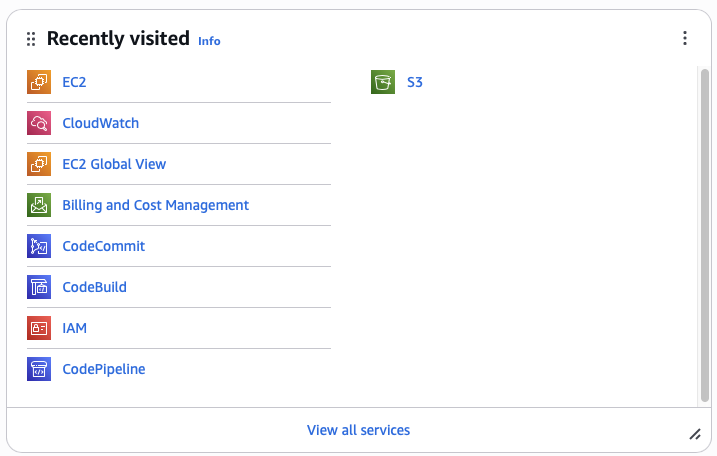
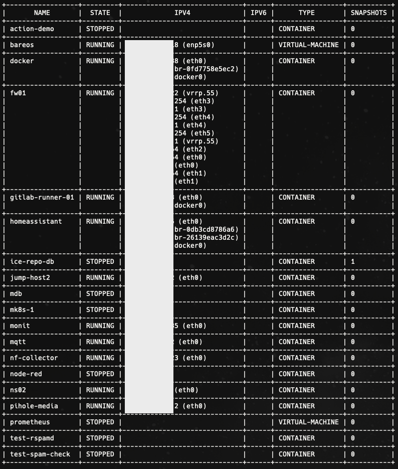
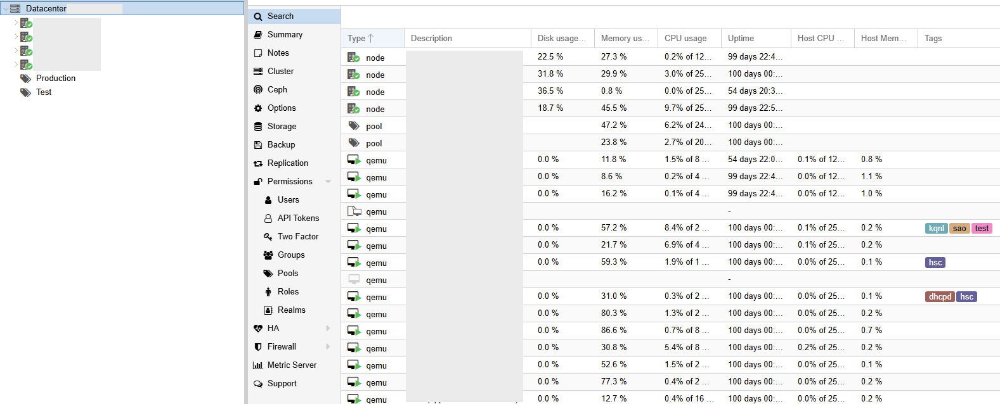
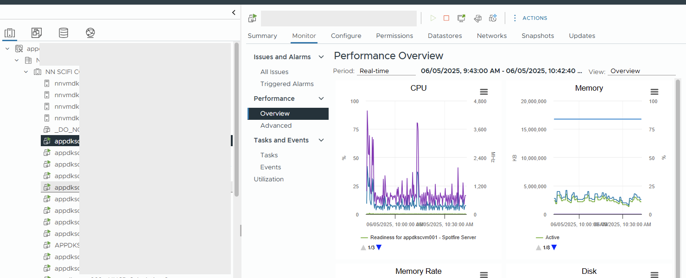
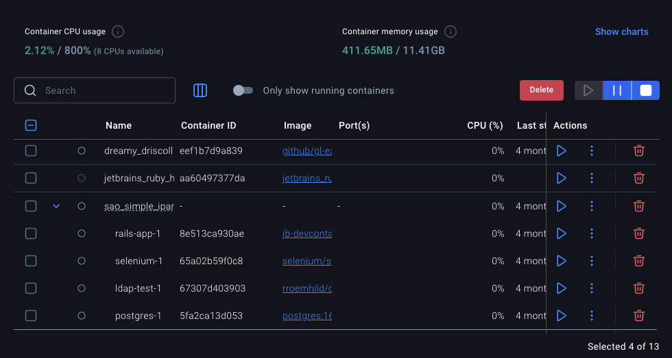

# Identify screenshots
1. 



2. 



3. 



4. 



5. 


# Identify code language
```yaml
- name: Ensure nginx is installed
  become: yes
  apt:
    name: nginx
    state: latest
  tags: nginx

- name: Ensure that {{ nginx_ssl_dhparam | dirname }} exists
  become: yes
  file:
    state: directory
    path: "{{ nginx_ssl_dhparam | dirname }}"
    owner: root
    group: root
    mode: "0640"
  tags: nginx

- name: Check if dhparam exists
  become: yes
  stat:
    path: "{{ nginx_ssl_dhparam }}"
  register: ssl_dhparam

- name: Generate {{ nginx_ssl_dhparam }}
  become: yes
  command: "openssl dhparam -out {{ nginx_ssl_dhparam }} 4096"
  when: "ssl_dhparam.stat.exists == false"
  tags: nginx
  notify: Restart nginx

- name: Install conf files
  become: yes
  ansible.builtin.template:
    src: "{{ item }}.conf.j2"
    dest: "{{ nginx_conf_base }}/conf.d/{{ item }}.conf"
    owner: root
    group: root
    mode: "0644"
    backup: yes
  loop:
    - ssl
    - max-body
    - content-security-policy
    - log
  tags:
    - nginx
    - csp
  notify: Restart nginx
```
