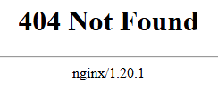

# Troubleshooting questions

## 1st problem
A user reports that they cannot connect to the internet. What steps would you take to troubleshoot this issue?

## 2nd problem
A user reports that they get following error message when trying to access the web application on https://example.com: "SSL connection error". What steps would you take to troubleshoot this issue?

## 3rd problem
A user reports that they get following error message when trying to access the web application on https://example.com:  

What steps would you take to troubleshoot this issue?
